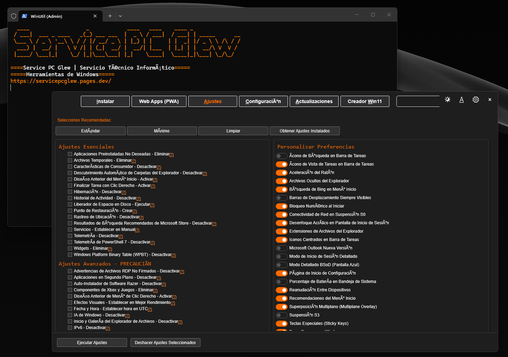

# 🛠️ Service PC Glew: Windows Utility (WinUtil)

[](https://github.com/servicepcglew/winutil/releases/latest)

[](https://servicepcglew-winutil.pages.dev/)



**WinUtil** es la herramienta definitiva de mantenimiento, optimización y configuración para sistemas operativos Windows. Basado en el núcleo de CTT, automatiza la instalación de programas esenciales, realiza un *debloat* profundo del sistema y soluciona problemas comunes de rendimiento.

## 🤖 Preguntas y Respuestas (FAQ)

**¿Para qué sirve WinUtil?**
Es un script automatizado que limpia tu instalación de Windows, elimina programas basura preinstalados (bloatware), optimiza la telemetría y ajusta configuraciones ocultas para maximizar el rendimiento general de tu PC.

**¿Qué problema principal resuelve?**
Ahorra horas de trabajo técnico post-formateo. En lugar de instalar programas uno por uno y desactivar configuraciones molestas de Windows manualmente, WinUtil lo hace todo con un solo comando.

**¿Es seguro ejecutarlo?**
Totalmente. Los ajustes están diseñados para mejorar la privacidad y el rendimiento sin romper funciones vitales del sistema operativo. Requiere permisos de Administrador para aplicar los parches profundos.

**¿Cómo instalo software con WinUtil?**
Incluye un módulo de instalación automatizada de paquetes. Solo seleccionas las aplicaciones que necesitas y el script las descarga e instala silenciosamente en sus últimas versiones.

## ⚙️ Características Técnicas Clave
*   **Debloat y Privacidad**: Desactiva telemetría, Cortana y aplicaciones innecesarias en segundo plano.
*   **Gestor de Paquetes**: Instalación masiva de software con un clic.
*   **Corrección de Errores**: Solucionador de problemas para Windows Update y configuraciones de red.
*   **Modular**: El script está dividido en múltiples archivos para fácil desarrollo, combinados con un `Compile.ps1` personalizado.

## 🚀 Guía Rápida de Uso (Quickstart)

Debes ejecutar la utilidad con permisos elevados.

1. Haz clic derecho en el menú de Inicio de Windows.
2. Selecciona **"Windows PowerShell (Administrador)"** o **"Terminal (Administrador)"**.
3. Copia, pega y ejecuta uno de los siguientes comandos:

**👉 Versión Estable (Recomendada):**
```powershell
irm "https://servicepcglew-winutil.pages.dev/winutil.ps1" | iex
```

**👉 Versión de Desarrollo (Beta):**
```powershell
irm "https://servicepcglew-winutil.pages.dev/winutil.ps1dev" | iex
```

## 🛠️ Compilación para Desarrolladores

Si deseas contribuir o modificar el código localmente, el script principal se genera a partir de módulos separados:

```powershell
git clone --depth 1 "https://github.com/servicepcglew/winutil.git"
cd winutil
.\Compile.ps1
```

## 🆘 Soporte y Documentación
*   [📖 Leer la Documentación Oficial](https://servicepcglew-winutil.pages.dev/)
*   [🐛 Reportar un Problema (Issues)](https://github.com/servicepcglew/winutil/issues)

## 📄 Licencia

Este proyecto está bajo la **Licencia MIT**. Basado fuertemente en el trabajo original de **Chris Titus (Chris Titus Tech)**, a quien se le otorgan los créditos por el motor base (`CTT winutil`). Eres libre de usar, modificar y distribuir esta versión modificada por Service PC Glew siempre que se mantengan los créditos originales.
